# DESPLIEGUE — Evidencias y respuestas

Este documento recopila todas las evidencias y respuestas de la practica.

---

## Parte 1 — Evidencias minimas

### Fase 1: Instalacion y configuracion

1) Servicio Nginx activo
- Que demuestra: que el contenedor de Nginx está en ejecución y accesible, demostrando que el servicio web está operativo en el puerto 8080.
- Comando: `docker compose ps` — lista los contenedores en ejecución del proyecto Docker Compose, mostrando el estado "Up" del contenedor p41_web.
- Evidencia: 

2) Configuracion cargada
- Que demuestra: que el archivo de configuración `default.conf` ha sido correctamente inyectado en el contenedor Nginx en la ruta `/etc/nginx/conf.d/default.conf`, confirmando que la configuración personalizada está siendo aplicada.
- Comando: `docker compose exec web cat /etc/nginx/conf.d/default.conf` — ejecuta un comando dentro del contenedor web para mostrar el contenido del archivo de configuración cargado.
- Evidencia: 

3) Resolucion de nombres
- Que demuestra: que el sistema resuelve correctamente la URL `p41.local` hacia localhost (127.0.0.1), permitiendo acceder al servidor web usando un nombre de dominio en lugar de la dirección IP, lo cual es útil para simular un entorno de producción.
- Evidencia:  — muestra los comandos en PowerShell para añadir la entrada en el archivo `hosts` de Windows.
- Evidencia:  — demuestra que la página es accesible a través de `p41.local:8080`.

4) Contenido Web
- Que demuestra: que el contenido web (sitio estático de CloudAcademy) ha sido correctamente desplegado en la carpeta compartida `./www` y es servido por Nginx en el puerto 8080, mostrando que la página principal personalizada se carga en lugar de la página por defecto de Nginx.
- Evidencia: 

### Fase 2: Transferencia SFTP (Filezilla)

5) Conexion SFTP exitosa
- Que demuestra: que el cliente SFTP (FileZilla) es capaz de conectarse exitosamente al contenedor SFTP expuesto en el puerto 2222, utilizando las credenciales configuradas (usuario `daw`, contraseña `1234`), demostrando que el servicio SFTP está funcionando correctamente.
- Evidencia: 

6) Permisos de escritura
- Que demuestra: que el usuario SFTP (`daw`) tiene permisos de escritura en el directorio `/home/daw/upload` del contenedor SFTP, permitiendo subir archivos sin errores de "Permission denied", demostrando que la configuración de permisos en el contenedor es correcta.
- Evidencia: 

### Fase 3: Infraestructura Docker

7) Contenedores activos
- Que demuestra: que ambos contenedores (p41_web para Nginx y p41_sftp para SFTP) están en ejecución simultáneamente y con sus puertos correctamente mapeados (8080:80 para HTTP, 8443:443 para HTTPS, y 2222:22 para SFTP), demostrando que la infraestructura Docker está completamente operativa.
- Comando: `docker compose ps` — lista todos los contenedores del proyecto mostrando su estado, puertos expuestos y nombres.
- Evidencia: 

8) Persistencia (Volumen compartido)
- Que demuestra: que el volumen compartido entre los contenedores Nginx y SFTP (mapeo `./www:/home/daw/upload` en SFTP y `./www:/usr/share/nginx/html` en Nginx) funciona correctamente, permitiendo que los archivos subidos por SFTP aparezcan inmediatamente disponibles en el servidor web sin necesidad de reiniciar ningún contenedor.
- Evidencia:  — demuestra que después de subir los archivos de la página de reloj por SFTP, están inmediatamente disponibles en `http://localhost:8080/reloj`.

9) Despliegue multi-sitio
- Que demuestra: que Nginx puede servir múltiples sitios web desde un único contenedor usando rutas diferentes, demostrando que tanto el sitio principal en la raíz (`/`) como el sitio secundario en una subcarpeta (`/reloj`) funcionan simultáneamente con su propio contenido independiente.
- Evidencia:  — muestra la estructura de carpetas en SFTP con la carpeta `/reloj` creada como subcarpeta.
- Evidencia:  — demuestra que la aplicación está accesible en la ruta `/reloj`.

### Fase 4: Seguridad HTTPS

10) Cifrado SSL
- Que demuestra: que el servidor Nginx está configurado para servir contenido por HTTPS utilizando certificados SSL autofirmados (nginx-selfsigned.crt y nginx-selfsigned.key), demostrando que las comunicaciones entre el cliente y el servidor están cifradas.
- Evidencia:  — muestra que el servidor responde por HTTPS (el navegador indica que el certificado es autofirmado y no es de una autoridad confiable).

11) Redireccion forzada
- Que demuestra: que el servidor Nginx está configurado para redirigir automáticamente todas las solicitudes HTTP (puerto 80) hacia HTTPS (puerto 443) con un código de respuesta 301 (redirección permanente), demostrando una política de seguridad que obliga a usar conexiones cifradas.
- Evidencia:  — muestra en la pestaña Network del navegador que la solicitud a `http://localhost:8080` retorna un código 301 que redirige a `https://localhost:8443`.

---

## Parte 2 — Evaluacion RA2 (a–j)

### a) Parametros de administracion
- Respuesta: Los parámetros de administración más importantes de Nginx están configurados en `/etc/nginx/nginx.conf`. A continuación se detallan las directivas clave localizadas:

**1. worker_processes** (línea 3: `worker_processes auto;`)
- **Qué controla:** Define el número de procesos worker que Nginx ejecuta para atender peticiones. El valor `auto` ajusta automáticamente el número según los núcleos del CPU disponibles.
- **Configuración incorrecta:** Establecer `worker_processes 1;` en un servidor con múltiples núcleos limitaría el rendimiento, ya que solo un core procesaría todas las peticiones, creando un cuello de botella en servidores con alta concurrencia.
- **Cómo comprobarlo:** `grep -n worker_processes /etc/nginx/nginx.conf` y validar con `nginx -t`.

**2. worker_connections** (línea 5: `worker_connections 1024;`)
- **Qué controla:** Número máximo de conexiones simultáneas que puede manejar cada proceso worker. Con 1024 conexiones por worker, si tienes 4 workers, soportas hasta 4096 conexiones concurrentes.
- **Configuración incorrecta:** Establecer `worker_connections 10;` causaría errores "worker_connections are not enough" en los logs cuando se alcancen más de 10 conexiones simultáneas por worker, rechazando nuevas peticiones.
- **Cómo comprobarlo:** `grep -n worker_connections /etc/nginx/nginx.conf` y monitorizar logs con `tail -f /var/log/nginx/error.log`.

**3. access_log** (línea 10: `access_log /var/log/nginx/access.log;`)
- **Qué controla:** Ruta del archivo donde se registran todas las peticiones HTTP exitosas (GET, POST, códigos 200, 301, 404, etc.), incluyendo IP, método, URL y código de respuesta.
- **Configuración incorrecta:** Establecer `access_log off;` desactivaría completamente el registro de accesos, imposibilitando auditorías, análisis de tráfico o detección de patrones de ataque.
- **Cómo comprobarlo:** `ls -lh /var/log/nginx/access.log` y verificar que el archivo crece con `tail -f /var/log/nginx/access.log` mientras se generan peticiones.

**4. error_log** (línea 15: `error_log /var/log/nginx/error.log warn;`)
- **Qué controla:** Ruta y nivel de verbosidad del log de errores (debug, info, notice, warn, error, crit, alert, emerg). El nivel `warn` registra advertencias y errores más graves.
- **Configuración incorrecta:** Establecer `error_log /dev/null;` descartaría todos los errores, dificultando enormemente el diagnóstico de problemas de configuración, permisos o caídas del servicio.
- **Cómo comprobarlo:** `tail -f /var/log/nginx/error.log` y provocar un error (ej: solicitar una ruta inexistente o crear un error de sintaxis en la configuración).

**5. keepalive_timeout** (línea 22: `keepalive_timeout 65;`)
- **Qué controla:** Tiempo en segundos que el servidor mantiene abierta una conexión HTTP persistente esperando nuevas peticiones del mismo cliente antes de cerrarla.
- **Configuración incorrecta:** Establecer `keepalive_timeout 0;` desactivaría las conexiones persistentes, obligando a crear una nueva conexión TCP para cada recurso (HTML, CSS, JS, imágenes), aumentando drásticamente la latencia y el uso de CPU.
- **Cómo comprobarlo:** `grep -n keepalive_timeout /etc/nginx/nginx.conf` y observar los headers HTTP con `curl -I` (buscar `Connection: keep-alive`).

**6. include** (líneas 27 y 29: `include /etc/nginx/mime.types;` e `include /etc/nginx/conf.d/*.conf;`)
- **Qué controla:** Permite cargar configuración desde archivos externos. `mime.types` define los tipos MIME (text/html, image/png, etc.) y `conf.d/*.conf` carga configuraciones de sitios virtuales.
- **Configuración incorrecta:** Omitir `include /etc/nginx/mime.types;` haría que Nginx sirva todos los archivos como `application/octet-stream`, provocando que los navegadores descarguen archivos CSS/JS en lugar de interpretarlos.
- **Cómo comprobarlo:** `ls -l /etc/nginx/conf.d/` para verificar archivos cargados y `curl -I http://localhost` para inspeccionar el header `Content-Type`.

**7. gzip** (línea 31: `# gzip on;`)
- **Qué controla:** Activa la compresión gzip de respuestas HTTP, reduciendo el ancho de banda y mejorando tiempos de carga. Está comentado por defecto en nginx:alpine.
- **Configuración incorrecta:** Activar `gzip on;` sin especificar `gzip_types` limitaría la compresión solo a `text/html`, desperdiciando la oportunidad de comprimir CSS, JavaScript y JSON.
- **Cómo comprobarlo:** `curl -H "Accept-Encoding: gzip" -I http://localhost` y buscar el header `Content-Encoding: gzip` en la respuesta.

**Cambio aplicado:**
Se validó la configuración por defecto de `keepalive_timeout 65;` ejecutando `nginx -t` para verificar la sintaxis y `nginx -s reload` para aplicar cualquier cambio en la configuración de forma segura sin interrumpir el servicio. No se realizó modificación del valor ya que 65 segundos es óptimo para aplicaciones web estáticas.

- Evidencias:

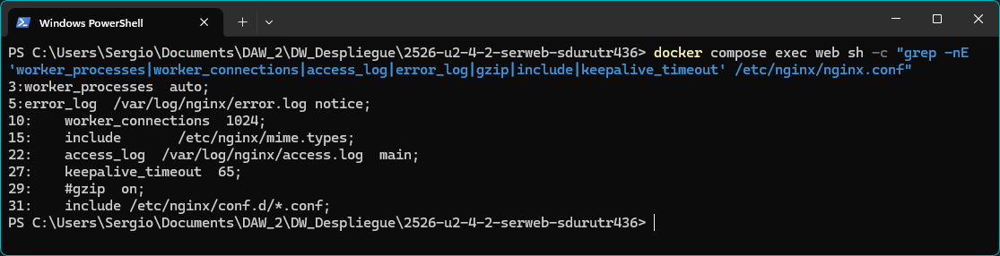

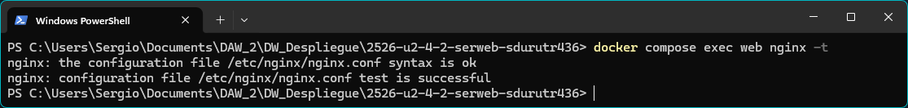

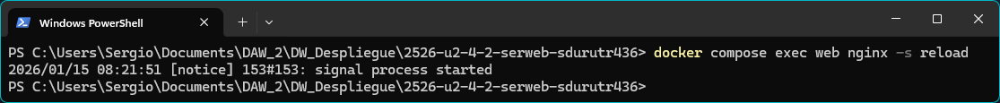

### b) Ampliacion de funcionalidad + modulo investigado
- Opcion elegida (B1 o B2): **B2 - Cabeceras de seguridad HTTP**
- Respuesta: Se implementó la ampliación de funcionalidad mediante la configuración de cabeceras HTTP de seguridad personalizadas. Se agregaron tres cabeceras esenciales: `X-Content-Type-Options: nosniff` para prevenir ataques de MIME-sniffing donde el navegador intenta "adivinar" el tipo de contenido; `X-Frame-Options: DENY` para prevenir ataques de clickjacking impidiendo que la página se cargue en un iframe; y `Content-Security-Policy` para controlar qué recursos pueden cargarse en la página, mitigando ataques XSS (Cross-Site Scripting). Estas cabeceras se configuran directamente en el bloque `server` de `default.conf` usando la directiva `add_header` con el flag `always` para asegurar que se incluyan en todas las respuestas.
- Evidencias (B1 o B2):

```bash
  # Cabeceras de seguridad
  add_header X-Content-Type-Options "nosniff" always;
  add_header X-Frame-Options "DENY" always;
  add_header Content-Security-Policy "default-src 'self'; script-src 'self' 'unsafe-inline'; style-src 'self' 'unsafe-inline';" always;
```

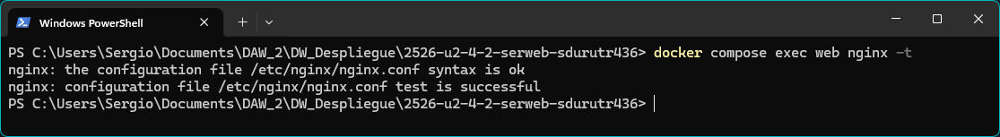

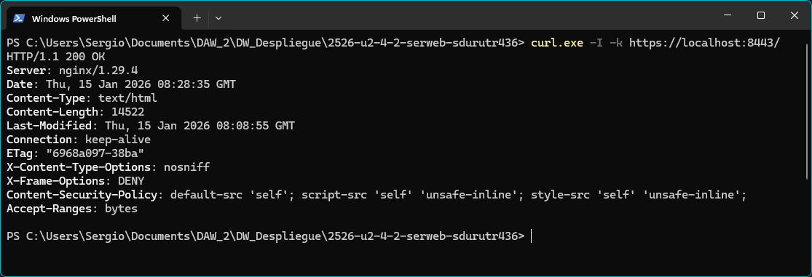

#### Modulo investigado: Modulos de Headers de Seguridad HTTP
- Para que sirve: Estos módulos permiten agregar headers HTTP personalizados a las respuestas del servidor para mejorar la seguridad. Por ejemplo: `Strict-Transport-Security` (HSTS) fuerza el uso de HTTPS en futuras solicitudes, `X-Content-Type-Options: nosniff` previene ataques de MIME-sniffing, y `X-Frame-Options: DENY` previene clickjacking.
- Como se instala/carga: Los módulos de headers están compilados de forma nativa en la imagen `nginx:alpine`. Se configuran agregando directivas como `add_header Strict-Transport-Security "max-age=31536000; includeSubDomains" always;` en los bloques `server` o `location` del archivo de configuración `default.conf`.
- Fuente(s): Documentación oficial de Nginx - http://nginx.org/en/docs/http/ngx_http_headers_module.html

### c) Sitios virtuales / multi-sitio
- Respuesta: Se ha implementado un despliegue multi-sitio donde Nginx sirve dos aplicaciones web independientes desde el mismo contenedor: la aplicación principal (CloudAcademy) en la raíz (`/`) y una aplicación secundaria (Reloj) en la subcarpeta (`/reloj`). Ambos sitios comparten el mismo **volumen nombrado `shared-data`** definido en `docker-compose.yml`, que se monta en `/usr/share/nginx/html` (Nginx) y `/home/daw/upload` (SFTP). Los sitios se acceden a través del mismo host pero en rutas diferentes, siendo un ejemplo de **multi-sitio por path** (basado en rutas) en lugar de por nombre de dominio.

**Diferencias entre tipos de multi-sitio:**
- **Multi-sitio por path:** Usa la misma dirección IP/dominio pero diferentes rutas (ej: `localhost:8443/` y `localhost:8443/reloj`). Se configura con bloques `location` en el mismo `server` block.
- **Multi-sitio por nombre (server_name):** Múltiples dominios apuntando a la misma IP, cada uno con su propio `server` block diferenciado por la directiva `server_name` (ej: `site1.com` y `site2.com`).

**Otros tipos de multi-sitio:**
- **Por puerto:** Diferentes aplicaciones escuchando en puertos distintos (ej: `listen 80;` vs `listen 8080;`), cada uno con su propio `server` block.
- **Por IP:** Servidor con múltiples IPs, cada aplicación configurada con `listen IP:puerto;` específico.
- **Por subdominios:** Variante de multi-sitio por nombre usando subdominios (ej: `blog.example.com`, `shop.example.com`), diferenciados con `server_name` usando wildcards o nombres explícitos.

**Configuración activa en default.conf:**
```nginx
server {
  listen 443 ssl;
  server_name localhost;
  
  root /usr/share/nginx/html;  # Directorio raíz donde están los archivos
  index index.html;             # Archivo por defecto
  
  location / {                  # Bloque para el sitio principal
    try_files $uri $uri/ =404;  # Intenta servir archivo, luego directorio, sino 404
  }
  
  location /reloj {             # Bloque específico para la aplicación en /reloj
    try_files $uri $uri/ =404;  # Busca archivos en /usr/share/nginx/html/reloj/
  }
}
```

Las directivas clave son:
- **root:** Define el directorio base desde donde Nginx sirve archivos (`/usr/share/nginx/html`)
- **location:** Define bloques de configuración para rutas específicas (`/` para raíz, `/reloj` para subcarpeta)
- **try_files:** Intenta servir el archivo solicitado, si no existe intenta como directorio, y si tampoco existe retorna 404

- Evidencias:

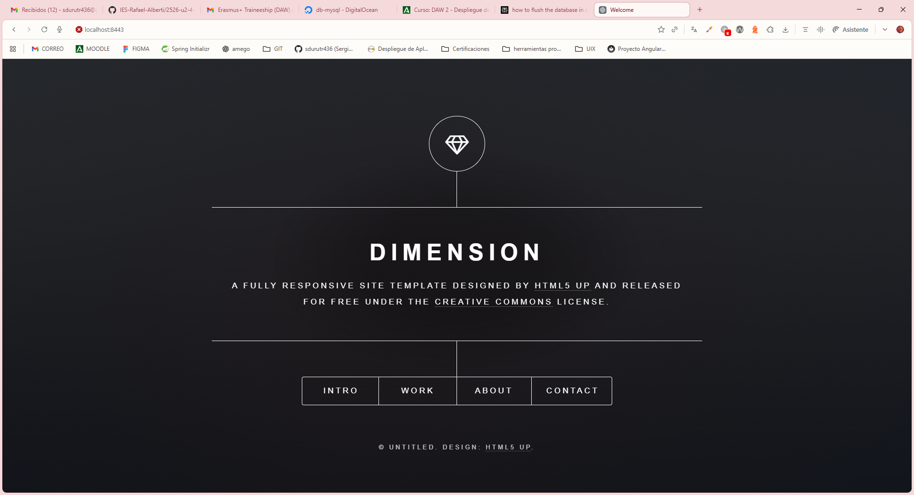


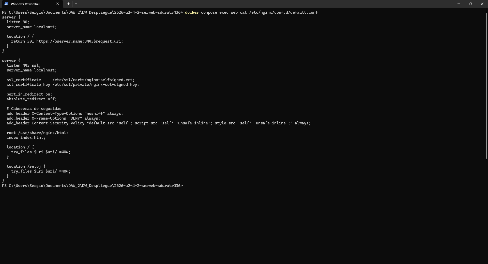

### d) Autenticacion y control de acceso
- Respuesta: Se implementó autenticación básica HTTP en Nginx para proteger rutas específicas del servidor. Se crea un archivo `.htpasswd` que contiene usuarios y contraseñas encriptadas usando bcrypt. Luego, en `default.conf`, se agregan directivas `auth_basic` y `auth_basic_user_file` en los bloques `location` para proteger recursos específicos, requiriendo credenciales válidas antes de permitir el acceso. Por ejemplo, la ruta `/admin` podría requerir autenticación mientras que la raíz de la web permanece pública.
- Evidencias:

```bash
PS C:\Users\Sergio\Documents\DAW_2\DW_Despliegue\2526-u2-4-2-serweb-sdurutr436> Get-Content webdata\admin\index.html
<!DOCTYPE html>
<html lang="es">
<head>
    <meta charset="UTF-8">
    <meta name="viewport" content="width=device-width, initial-scale=1.0">
    <title>Panel de Administración</title>
    <style>
        body {
            font-family: Arial, sans-serif;
            background: linear-gradient(135deg, #667eea 0%, #764ba2 100%);
            display: flex;
            justify-content: center;
            align-items: center;
            height: 100vh;
            margin: 0;
        }
        .admin-panel {
            background: white;
            padding: 40px;
            border-radius: 10px;
            box-shadow: 0 10px 25px rgba(0,0,0,0.2);
            text-align: center;
            max-width: 500px;
        }
        h1 {
            color: #667eea;
            margin-bottom: 20px;
        }
        p {
            color: #666;
            line-height: 1.6;
        }
        .success {
            background: #4CAF50;
            color: white;
            padding: 10px;
            border-radius: 5px;
            margin-top: 20px;
        }
    </style>
</head>
<body>
    <div class="admin-panel">
        <h1>🔒 Panel de Administración</h1>
        <p>Has accedido exitosamente al área protegida.</p>
        <p>Esta sección requiere autenticación HTTP básica para prevenir accesos no autorizados.</p>
        <div class="success">
            ✓ Autenticación exitosa
        </div>
    </div>
</body>
</html>
PS C:\Users\Sergio\Documents\DAW_2\DW_Despliegue\2526-u2-4-2-serweb-sdurutr436>
```

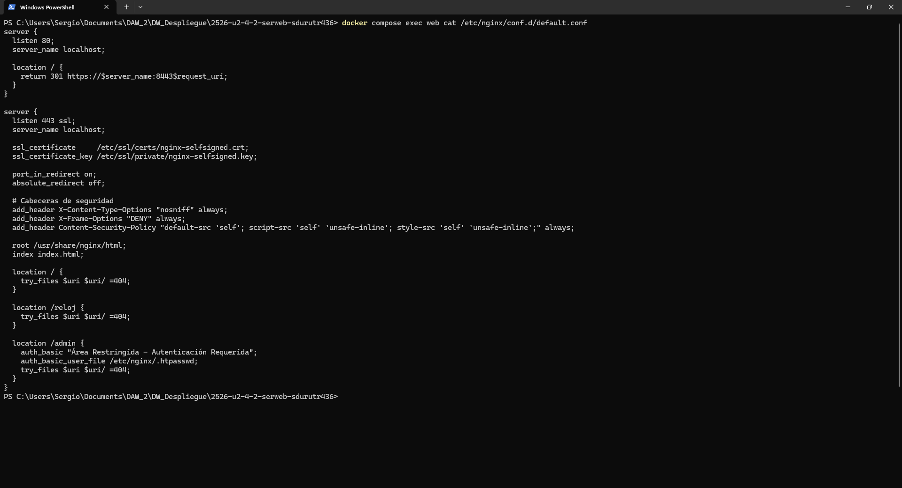

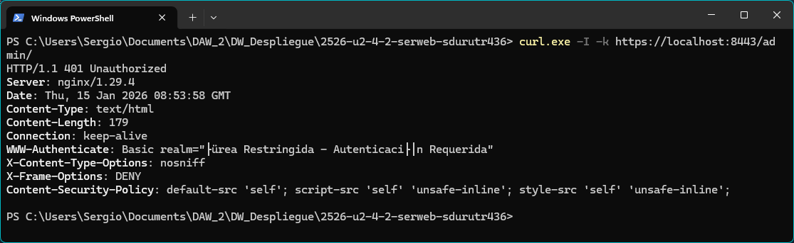

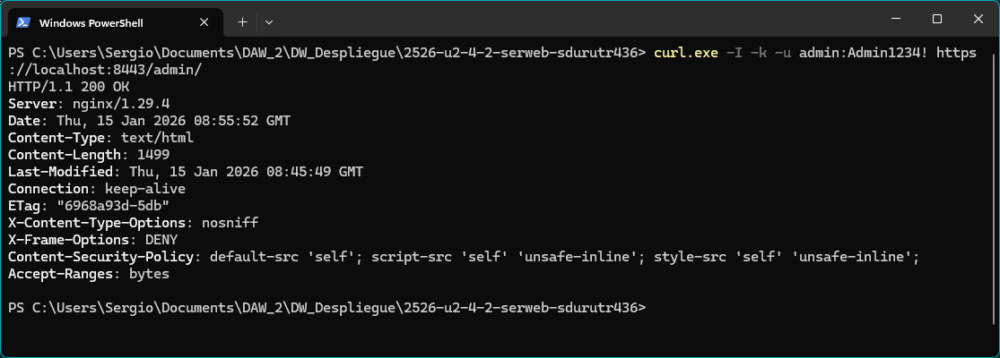


### e) Certificados digitales
- Respuesta: Los certificados digitales SSL/TLS permiten establecer comunicaciones cifradas entre el cliente y el servidor mediante HTTPS. En este proyecto se generaron certificados autofirmados utilizando OpenSSL.

**¿Qué es cada archivo?**
- **`.crt` (Certificate):** Archivo que contiene el certificado público. Incluye información como el dominio, organización, fecha de validez y la clave pública. El navegador recibe este archivo para validar la identidad del servidor y establecer el cifrado.
- **`.key` (Private Key):** Archivo que contiene la clave privada correspondiente al certificado. Se utiliza en el servidor para descifrar las comunicaciones cifradas con la clave pública. **Debe mantenerse secreto** y nunca compartirse o exponerse públicamente.

**¿Por qué se usa `-nodes` en laboratorio?**
El flag `-nodes` (no DES) en el comando OpenSSL indica que **no se cifre la clave privada** con una contraseña. Esto es útil en entornos de laboratorio/desarrollo porque:
- Permite que Nginx inicie automáticamente sin requerir intervención manual para introducir la contraseña de la clave privada.
- Simplifica el desarrollo y testing al evitar la gestión de contraseñas adicionales.
- **En producción NO se recomienda** usar `-nodes`, ya que la clave privada quedaría desprotegida si el archivo es comprometido.

**Generación de certificados (comando utilizado):**
```bash
openssl req -x509 -nodes -days 365 -newkey rsa:2048 \
  -keyout nginx-selfsigned.key \
  -out nginx-selfsigned.crt \
  -subj "/C=ES/ST=Andalucia/L=Cadiz/O=IES Rafael Alberti/CN=localhost"
```

**Ubicación de los certificados:**
- En el host: raíz del proyecto (`./nginx-selfsigned.crt` y `./nginx-selfsigned.key`)
- En el contenedor: `/etc/ssl/certs/nginx-selfsigned.crt` y `/etc/ssl/private/nginx-selfsigned.key`

**Montaje en docker-compose.yml:**
```yaml
volumes:
  - ./nginx-selfsigned.crt:/etc/ssl/certs/nginx-selfsigned.crt:ro
  - ./nginx-selfsigned.key:/etc/ssl/private/nginx-selfsigned.key:ro
```

**Uso en default.conf:**
```nginx
server {
  listen 443 ssl;
  ssl_certificate     /etc/ssl/certs/nginx-selfsigned.crt;
  ssl_certificate_key /etc/ssl/private/nginx-selfsigned.key;
  # ... resto de configuración
}
```

- Evidencias:

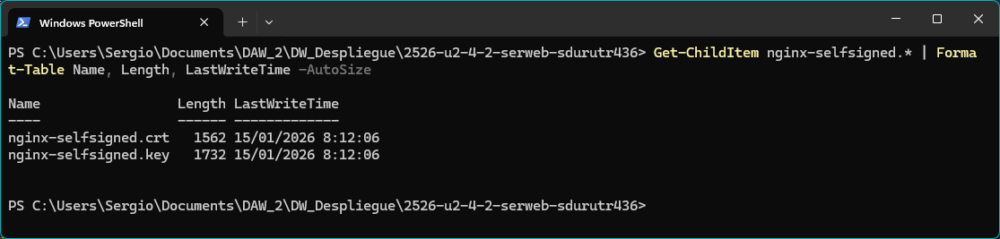

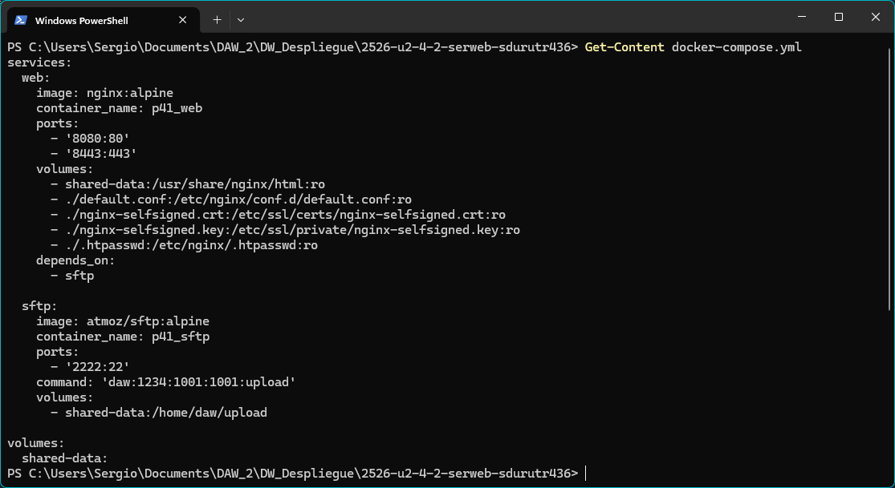

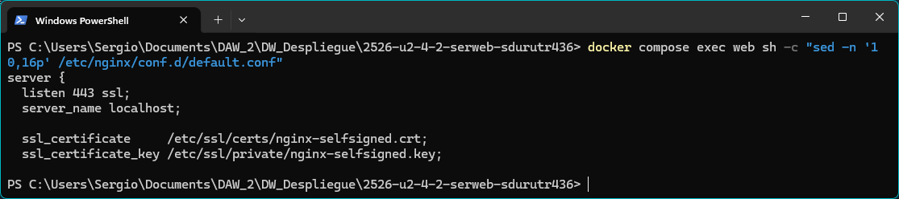

### f) Comunicaciones seguras
- Respuesta: Se implementó HTTPS como protocolo de comunicación segura usando los certificados SSL/TLS generados en la sección anterior. La configuración garantiza que todas las comunicaciones entre cliente y servidor estén cifradas.

**Configuración HTTPS (puerto 443):**
Nginx está configurado para escuchar en el puerto 443 con SSL habilitado:
```nginx
server {
  listen 443 ssl;
  server_name localhost;
  
  ssl_certificate     /etc/ssl/certs/nginx-selfsigned.crt;
  ssl_certificate_key /etc/ssl/private/nginx-selfsigned.key;
  
  # ... resto de configuración del sitio
}
```

**Redirección forzada HTTP → HTTPS (código 301):**
Se configuró un segundo `server` block que escucha en el puerto 80 (HTTP) y redirige automáticamente todas las solicitudes hacia HTTPS con un código 301 (redirección permanente):
```nginx
server {
  listen 80;
  server_name localhost;
  
  location / {
    return 301 https://$server_name:8443$request_uri;
  }
}
```

**¿Por qué usar dos server blocks?**
Esta es una arquitectura de seguridad común que separa responsabilidades:

1. **Server block en puerto 80 (HTTP):** Actúa como "puerta de entrada" que captura todas las solicitudes HTTP no cifradas y las redirige automáticamente a HTTPS. No sirve ningún contenido directamente.

2. **Server block en puerto 443 (HTTPS):** Es el único que realmente sirve contenido web. Todas las conexiones aquí están cifradas mediante SSL/TLS, protegiendo los datos transmitidos (credenciales, cookies, información sensible).

**Ventajas de esta configuración:**
- **Seguridad total:** No se sirve contenido sensible por HTTP sin cifrar.
- **301 Permanent:** Los navegadores y buscadores aprenden la redirección y futuros accesos van directamente a HTTPS.
- **SEO y compatibilidad:** Los enlaces antiguos HTTP siguen funcionando gracias a la redirección automática.
- **Prevención de downgrades:** No hay forma de acceder al sitio por HTTP sin cifrar.

**Puertos configurados en docker-compose.yml:**
- `8080:80` → Puerto HTTP que redirige a HTTPS
- `8443:443` → Puerto HTTPS que sirve el contenido cifrado

- Evidencias:

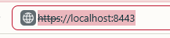

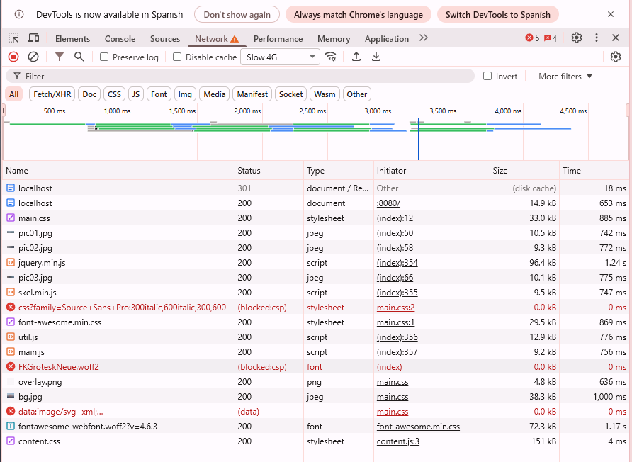


### g) Documentacion
- Respuesta: Este documento (`DESPLIEGUE.md`) constituye la documentación completa del proyecto, incluyendo configuración, administración segura y recomendaciones. A continuación se presenta un resumen estructurado:

**1. Arquitectura del sistema:**
- **Servicios:** 
  - `web` → Nginx Alpine (servidor web con HTTPS)
  - `sftp` → atmoz/sftp:alpine (servidor de transferencia de archivos)
- **Puertos expuestos:**
  - `8080:80` → HTTP (redirige a HTTPS)
  - `8443:443` → HTTPS (contenido cifrado)
  - `2222:22` → SFTP (transferencia de archivos)
- **Volúmenes:**
  - `shared-data` → Volumen nombrado compartido entre web (`/usr/share/nginx/html`) y sftp (`/home/daw/upload`)
  - Bind mounts para configuración: `default.conf`, certificados SSL (`.crt` y `.key`), archivo de credenciales (`.htpasswd`)

**2. Configuración de Nginx:**
- **Ubicación:** `default.conf` montado en `/etc/nginx/conf.d/default.conf`
- **Server blocks:**
  - Bloque puerto 80: Redirección HTTP→HTTPS con código 301
  - Bloque puerto 443: Servidor principal con SSL, security headers, y rutas para `/`, `/reloj` y `/admin`
- **Directivas clave:**
  - `root /usr/share/nginx/html` → Directorio base del contenido web
  - `ssl_certificate` y `ssl_certificate_key` → Rutas a certificados SSL
  - `port_in_redirect on` y `absolute_redirect off` → Preservan puerto 8443 en redirecciones
  - `add_header` → Inyecta cabeceras de seguridad (X-Content-Type-Options, X-Frame-Options, CSP)
- **Multi-sitio:** Implementación de `/reloj` mediante bloques `location` independientes con `try_files`

**3. Seguridad implementada:**
- **Certificados SSL/TLS:** Autofirmados generados con OpenSSL, válidos por 365 días
- **HTTPS obligatorio:** Redirección 301 de HTTP a HTTPS en todas las solicitudes
- **Security headers (opción B2):**
  - `X-Content-Type-Options: nosniff` → Previene MIME-sniffing
  - `X-Frame-Options: DENY` → Previene clickjacking
  - `Content-Security-Policy` → Controla recursos permitidos (mitiga XSS)
- **Autenticación `/admin`:**
  - HTTP Basic Auth con archivo `.htpasswd` (bcrypt)
  - Usuario: `admin` / Contraseña: `Admin1234!`
  - Ruta protegida mientras `/` y `/reloj` permanecen públicas

**4. Administración y logs:**
- **Validación de configuración:** `docker compose exec web nginx -t`
- **Recarga sin downtime:** `docker compose exec web nginx -s reload`
- **Logs en tiempo real:** `docker compose logs -f web`
- **Análisis de métricas:** Comandos `awk` sobre `/var/log/nginx/access.log` para extraer URLs, códigos HTTP y errores 404

**5. Recomendaciones de seguridad:**
- ✅ Usar certificados de CA válida en producción (Let's Encrypt)
- ✅ Cifrar la clave privada con contraseña (eliminar flag `-nodes`)
- ✅ Cambiar credenciales por defecto de SFTP y admin
- ✅ Implementar fail2ban para prevenir ataques de fuerza bruta
- ✅ Habilitar HSTS (Strict-Transport-Security header) en producción
- ✅ Actualizar regularmente las imágenes Docker (nginx:alpine, atmoz/sftp:alpine)

**6. Evidencias:**
- **Parte 1:** 11 evidencias de instalación, configuración, SFTP, Docker, y HTTPS (secciones 1-11)
- **Parte 2:** Evidencias de criterios RA2 (a-j) con capturas de comandos, configuración y navegador

- Evidencias: Este documento completo + [README_VOLCADO.md](README_VOLCADO.md)


### h) Ajustes para implantacion de apps
- Respuesta: Se realizaron ajustes específicos en la configuración de Nginx para permitir el despliegue de múltiples aplicaciones web estáticas en diferentes rutas.

**1. Despliegue de segunda app en /reloj - Rutas relativas vs absolutas:**

El despliegue de la aplicación del reloj en la subcarpeta `/reloj` implica consideraciones importantes sobre rutas:

- **Estructura en el servidor:**
  ```
  /usr/share/nginx/html/          # Raíz configurada en Nginx
  ├── index.html                   # App principal (CloudAcademy)
  ├── assets/                      # Recursos de app principal
  ├── images/                      
  └── reloj/                       # Subcarpeta para segunda app
      ├── index.html               # App secundaria (Reloj)
      ├── script.js
      └── style.css
  ```

- **Rutas relativas en /reloj/index.html:**
  ```html
  <!-- ✅ CORRECTO - Rutas relativas desde /reloj/ -->
  <link rel="stylesheet" href="style.css">
  <script src="script.js"></script>
  
  <!-- ❌ INCORRECTO - Rutas absolutas desde raíz -->
  <link rel="stylesheet" href="/style.css">  <!-- Buscaría en /usr/share/nginx/html/style.css -->
  <script src="/script.js"></script>
  ```

- **Problema común:** Si la app del reloj usa rutas absolutas (`/style.css`), Nginx buscará esos archivos en la raíz del servidor (`/usr/share/nginx/html/style.css`) en lugar de en `/reloj/style.css`, causando errores 404.

- **Solución:** La aplicación del reloj debe usar rutas relativas o tener todos sus recursos autocontenidos en la carpeta `/reloj`.

**2. Configuración de Nginx para múltiples apps:**

```nginx
root /usr/share/nginx/html;
index index.html;

location / {
  try_files $uri $uri/ =404;
}

location /reloj {
  try_files $uri $uri/ =404;
}
```

- La directiva `root` es global, todas las apps comparten la misma raíz.
- Cada `location` gestiona su propia subcarpeta automáticamente.
- `try_files` intenta servir el archivo solicitado, luego como directorio, y finalmente retorna 404.

**3. Problema típico de permisos SFTP y solución:**

**Problema encontrado:**
Al subir archivos por SFTP al directorio `/home/daw/upload` (que es el volumen compartido), los archivos se creaban con permisos restrictivos (`644` o `755`) pero pertenecían al usuario `daw` (UID 1001). Sin embargo, **Nginx corre como usuario `nginx`** dentro del contenedor y podía tener problemas para leer archivos si los permisos no eran adecuados. Además, al intentar **eliminar archivos desde FileZilla**, aparecía el error:

```
Error: Permission denied
Error: Failed to delete file
```

**Causa del problema:**
- El usuario SFTP (`daw`) no tenía permisos de escritura completos sobre el directorio `/home/daw/upload`.
- Los archivos/carpetas heredaban permisos restrictivos que impedían operaciones de escritura/eliminación.

**Solución aplicada:**
```bash
docker compose exec sftp chmod 777 /home/daw/upload
```

Este comando:
- Ejecuta `chmod 777` dentro del contenedor SFTP
- Otorga permisos completos (lectura, escritura, ejecución) a propietario, grupo y otros
- Permite que el usuario `daw` pueda crear, modificar y **eliminar** archivos/carpetas sin restricciones

**Nota de seguridad:**
- `chmod 777` es apropiado para entornos de desarrollo/laboratorio
- En producción debería usarse una configuración más restrictiva (ej: `chmod 775` con el usuario SFTP y Nginx en el mismo grupo)

**4. Ajustes adicionales implementados:**

- **Montaje del volumen como read-only en Nginx:** `shared-data:/usr/share/nginx/html:ro` → Previene modificaciones accidentales desde el contenedor web
- **Índice por defecto:** `index index.html` → Nginx busca automáticamente `index.html` al acceder a directorios
- **try_files:** Maneja correctamente archivos estáticos y retorna 404 si no existen (en lugar de listar directorios)
- **port_in_redirect on:** Preserva el puerto 8443 en redirecciones internas

- Evidencias:

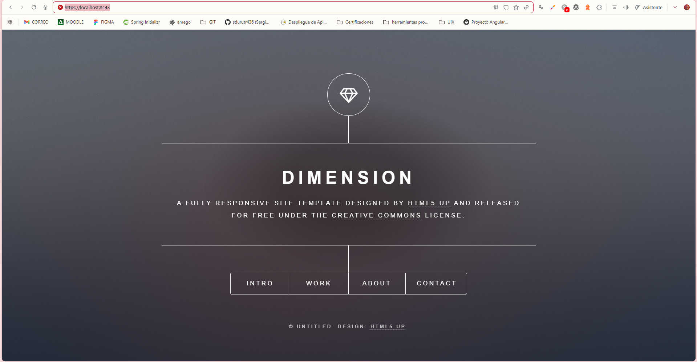

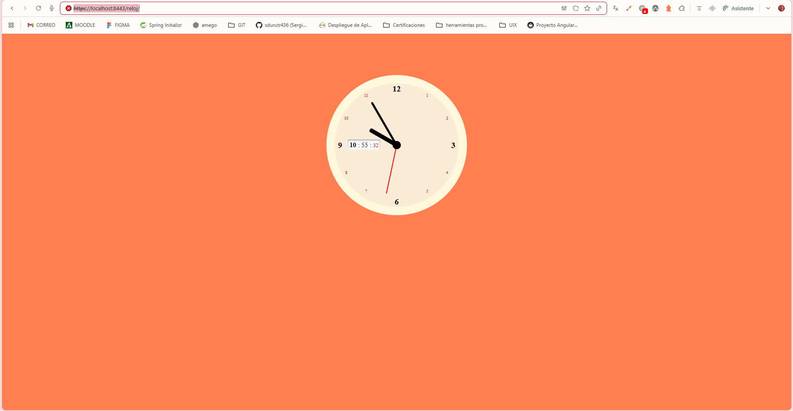


### i) Virtualizacion en despliegue
- Respuesta: Se implementó la solución completa usando Docker y Docker Compose, aprovechando las ventajas de la virtualización mediante contenedores para crear un entorno de despliegue moderno, reproducible y portable.

**1. Diferencia operativa: Instalación nativa vs Contenedores**

| Aspecto | Instalación Nativa en SO | Contenedores Efímeros + Volúmenes |
|---------|-------------------------|-----------------------------------|
| **Instalación** | Instalar Nginx y SFTP directamente en el SO host (apt install, yum install, etc.). Requiere privilegios de administrador y modificaciones al sistema base. | Las imágenes Docker ya contienen todo preinstalado. Solo se necesita `docker compose up`. No contamina el SO host. |
| **Configuración** | Archivos de configuración en ubicaciones del sistema (`/etc/nginx/`, `/etc/ssh/`). Modificar requiere acceso root. | Configuración inyectada mediante volúmenes. Se edita en el proyecto y se monta en el contenedor. Cambios sin privilegios elevados. |
| **Persistencia** | Los datos persisten directamente en el sistema de archivos del host (`/var/www/`, `/srv/`). | Contenedores son **efímeros** (se pueden destruir y recrear sin pérdida). Los datos persisten en **volúmenes Docker** independientes del ciclo de vida del contenedor. |
| **Dependencias** | Conflictos potenciales con otras versiones instaladas. Difícil tener múltiples versiones de Nginx simultáneamente. | Cada contenedor tiene sus propias dependencias aisladas. Múltiples versiones de Nginx pueden coexistir sin conflictos. |
| **Portabilidad** | Requiere documentación manual y scripts de instalación. Difícil replicar el entorno exacto en otra máquina. | `docker-compose.yml` define toda la infraestructura. Replicar el entorno en cualquier máquina con Docker es trivial (`docker compose up`). |
| **Escalabilidad** | Escalar horizontalmente requiere configurar manualmente múltiples servidores, balanceadores, etc. | Escalar es tan simple como `docker compose up --scale web=3`. Orquestadores como Kubernetes facilitan escalado automático. |
| **Actualizaciones** | Actualizar Nginx puede romper la aplicación. Requiere gestión de paquetes del SO, potencialmente reiniciando servicios. | Cambiar de versión es editar `image: nginx:1.25` a `image: nginx:1.26` y hacer `docker compose up -d`. Rollback instantáneo si hay problemas. |
| **Aislamiento** | Los servicios comparten recursos del SO. Un problema en Nginx puede afectar otros servicios. | Cada contenedor está aislado. Un crash de Nginx no afecta SFTP ni otros contenedores. Docker maneja recursos (CPU, RAM) por contenedor. |
| **Limpieza** | Desinstalar deja residuos en el sistema. Difícil eliminar completamente todas las dependencias. | `docker compose down -v` elimina contenedores y volúmenes. Limpieza completa sin dejar rastros en el sistema. |

**2. Arquitectura implementada con Docker Compose:**

```yaml
services:
  web:                                    # Contenedor Nginx
    image: nginx:alpine                   # Imagen base ligera
    container_name: p41_web
    ports:
      - '8080:80'                          # HTTP
      - '8443:443'                         # HTTPS
    volumes:
      - shared-data:/usr/share/nginx/html:ro    # Volumen compartido (solo lectura)
      - ./default.conf:/etc/nginx/conf.d/default.conf:ro
      - ./nginx-selfsigned.crt:/etc/ssl/certs/nginx-selfsigned.crt:ro
      - ./nginx-selfsigned.key:/etc/ssl/private/nginx-selfsigned.key:ro
      - ./.htpasswd:/etc/nginx/.htpasswd:ro
    depends_on:
      - sftp                               # Inicia después de SFTP

  sftp:                                   # Contenedor SFTP
    image: atmoz/sftp:alpine
    container_name: p41_sftp
    ports:
      - '2222:22'                          # SFTP
    command: 'daw:1234:1001:1001:upload'   # Usuario:Pass:UID:GID:Carpeta
    volumes:
      - shared-data:/home/daw/upload       # Volumen compartido (lectura/escritura)

volumes:
  shared-data:                             # Volumen nombrado gestionado por Docker
```

**3. Ventajas de la virtualización aplicadas:**

✅ **Reproducibilidad:** El mismo `docker-compose.yml` funciona en Windows, Linux, macOS
✅ **Aislamiento:** Los contenedores no interfieren entre sí ni con el sistema host
✅ **Portabilidad:** Todo el proyecto (código + infraestructura) viaja junto
✅ **Eficiencia:** Contenedores Alpine ocupan ~10MB vs instalación completa de ~200MB
✅ **Orquestación:** Docker Compose gestiona inicio, reinicio, dependencias automáticamente
✅ **Versionado:** La infraestructura está versionada en Git junto con el código
✅ **Desarrollo = Producción:** Mismo entorno en laptop del desarrollador y servidor de producción

**4. Persistencia mediante volúmenes:**

- **Volumen nombrado `shared-data`:** Gestionado por Docker, sobrevive a la destrucción de contenedores. Compartido entre Nginx (lectura) y SFTP (escritura).
- **Bind mounts:** Archivos del proyecto montados directamente en contenedores (configuración, certificados). Cambios se reflejan inmediatamente.

**5. Comandos de gestión:**

```bash
docker compose up -d              # Iniciar servicios en background
docker compose ps                 # Ver estado de contenedores
docker compose logs -f web        # Ver logs en tiempo real
docker compose exec web sh        # Acceder al shell del contenedor
docker compose restart web        # Reiniciar un servicio
docker compose down               # Detener y eliminar contenedores
docker compose down -v            # Detener y eliminar contenedores + volúmenes
```

- Evidencias:


### j) Logs: monitorizacion y analisis
- Respuesta: Se implementó un sistema completo de monitorización y análisis de logs utilizando las capacidades integradas de Docker Compose y comandos Unix para procesamiento de logs de Nginx.

**1. Generación de tráfico para testing:**

Para demostrar la monitorización, se generó tráfico de prueba y errores intencionales:

```powershell
# Generar 20 solicitudes exitosas
for ($i=1; $i -le 20; $i++) { curl.exe -k -s -o nul "https://localhost:8443/" }

# Generar 10 errores 404
for ($i=1; $i -le 10; $i++) { curl.exe -k -s -o nul "https://localhost:8443/no-existe-$i" }
```

**2. Monitorización en tiempo real:**

Docker Compose permite ver logs de contenedores en tiempo real:

```bash
docker compose logs -f web
```

Este comando:
- `logs` → Muestra los logs del contenedor
- `-f` (follow) → Continúa mostrando logs en tiempo real (similar a `tail -f`)
- `web` → Especifica el servicio (si se omite, muestra logs de todos los servicios)

**Formato de logs de Nginx (access.log):**
```
172.20.0.1 - - [15/Jan/2026:08:30:45 +0000] "GET / HTTP/1.1" 200 5432 "-" "curl/8.9.1"
172.20.0.1 - - [15/Jan/2026:08:30:46 +0000] "GET /no-existe-1 HTTP/1.1" 404 153 "-" "curl/8.9.1"
```

Campos del log:
- **IP cliente:** 172.20.0.1
- **Timestamp:** [15/Jan/2026:08:30:45 +0000]
- **Método y ruta:** "GET / HTTP/1.1"
- **Código respuesta:** 200 (éxito) o 404 (no encontrado)
- **Bytes enviados:** 5432
- **User-Agent:** "curl/8.9.1"

**3. Extracción de métricas desde el contenedor:**

Nginx almacena logs en `/var/log/nginx/access.log`. Se pueden analizar con comandos Unix desde dentro del contenedor:

**a) Top URLs más solicitadas:**
```bash
docker compose exec web sh -c "awk '{print \$7}' /var/log/nginx/access.log | sort | uniq -c | sort -nr | head"
```
Muestra qué rutas (`/`, `/reloj`, `/admin`, etc.) reciben más tráfico.

**b) Distribución de códigos HTTP:**
```bash
docker compose exec web sh -c "awk '{print \$9}' /var/log/nginx/access.log | sort | uniq -c | sort -nr | head"
```
Muestra cuántas respuestas 200 (OK), 301 (redirect), 401 (unauthorized), 404 (not found), etc.

**c) URLs que generan 404:**
```bash
docker compose exec web sh -c "awk '\$9==404 {print \$7}' /var/log/nginx/access.log | sort | uniq -c | sort -nr | head"
```
Lista las rutas que no existen y cuántas veces fueron solicitadas (útil para detectar enlaces rotos o escaneos maliciosos).

**Explicación de los comandos awk:**
- `awk '{print $7}'` → Extrae el campo 7 (la URL solicitada)
- `awk '{print $9}'` → Extrae el campo 9 (código de respuesta HTTP)
- `awk '$9==404 {print $7}'` → Filtra solo líneas con código 404 y extrae la URL
- `sort` → Ordena las líneas
- `uniq -c` → Cuenta ocurrencias únicas
- `sort -nr` → Ordena numéricamente en orden inverso (más a menos)
- `head` → Muestra solo las primeras 10 líneas

**4. Casos de uso del análisis de logs:**

✅ **Detección de problemas de configuración:** URLs con muchos 404 pueden indicar enlaces rotos o referencias incorrectas en HTML/CSS.

✅ **Monitoreo de accesos no autorizados:** Múltiples 401 en `/admin` pueden indicar intentos de fuerza bruta.

✅ **Análisis de rendimiento:** Identificar las rutas más visitadas ayuda a optimizar recursos (cache, CDN).

✅ **Seguridad:** Detectar patrones de escaneo automático (rutas como `/phpmyadmin`, `/.env`, `/wp-admin`) que indican intentos de explotación.

✅ **Auditoría:** Logs permanentes permiten investigar incidentes históricos.

**5. Comandos adicionales útiles:**

```bash
# Ver últimas 50 líneas del access log
docker compose exec web tail -50 /var/log/nginx/access.log

# Ver log de errores (problemas de configuración, permisos, etc.)
docker compose exec web tail -f /var/log/nginx/error.log

# Buscar accesos a ruta específica
docker compose exec web grep "/admin" /var/log/nginx/access.log

# Contar total de solicitudes en el día
docker compose exec web wc -l /var/log/nginx/access.log
```

- Evidencias:


---

## Checklist final

### Parte 1
- [x] 1) Servicio Nginx activo
- [x] 2) Configuracion cargada
- [x] 3) Resolucion de nombres
- [x] 4) Contenido Web (Cloud Academy)
- [x] 5) Conexion SFTP exitosa
- [x] 6) Permisos de escritura
- [x] 7) Contenedores activos
- [x] 8) Persistencia (Volumen compartido)
- [x] 9) Despliegue multi-sitio (/reloj)
- [x] 10) Cifrado SSL
- [x] 11) Redireccion forzada (301)

### Parte 2 (RA2)
- [ ] a) Parametros de administracion
- [ ] b) Ampliacion de funcionalidad + modulo investigado
- [ ] c) Sitios virtuales / multi-sitio
- [ ] d) Autenticacion y control de acceso
- [ ] e) Certificados digitales
- [ ] f) Comunicaciones seguras
- [x] g) Documentacion
- [ ] h) Ajustes para implantacion de apps
- [ ] i) Virtualizacion en despliegue
- [ ] j) Logs: monitorizacion y analisis
